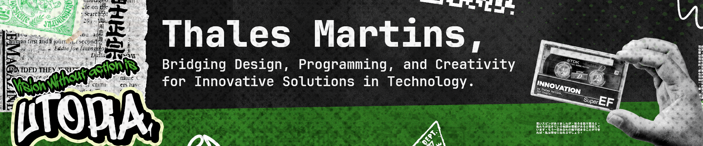
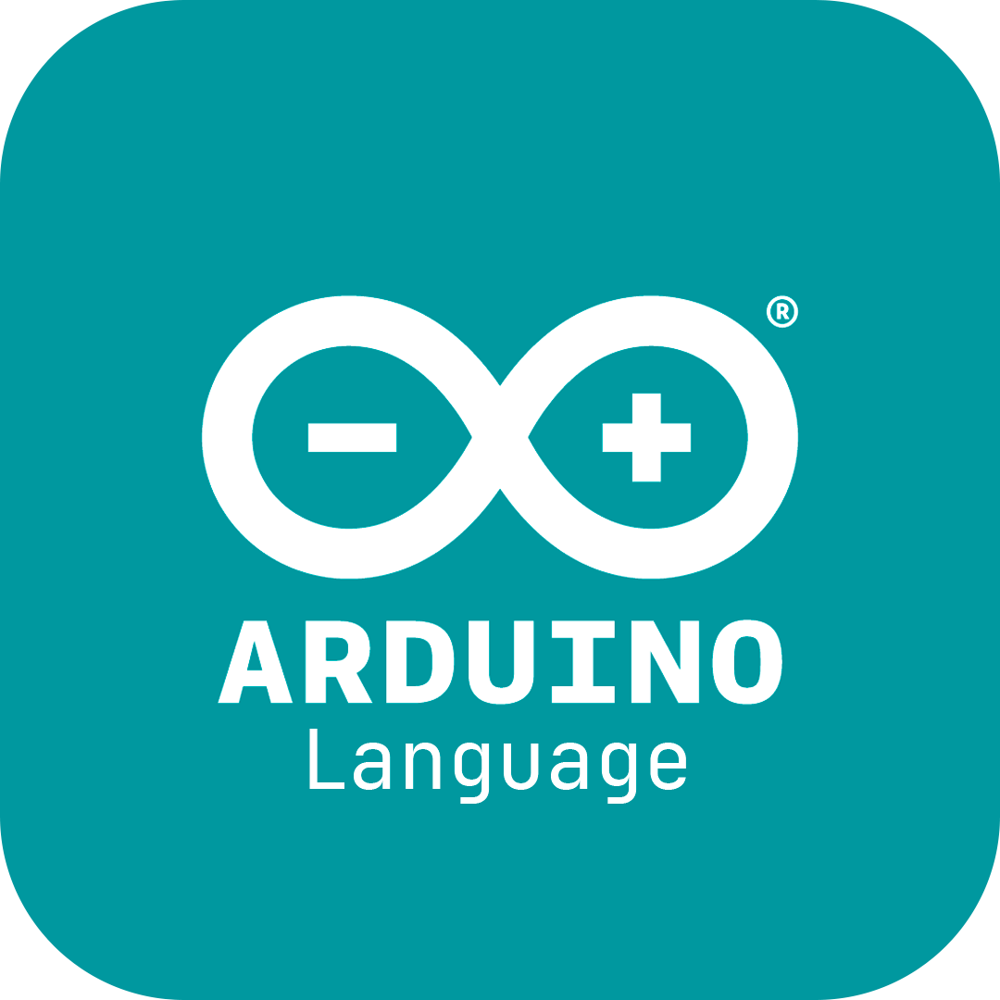
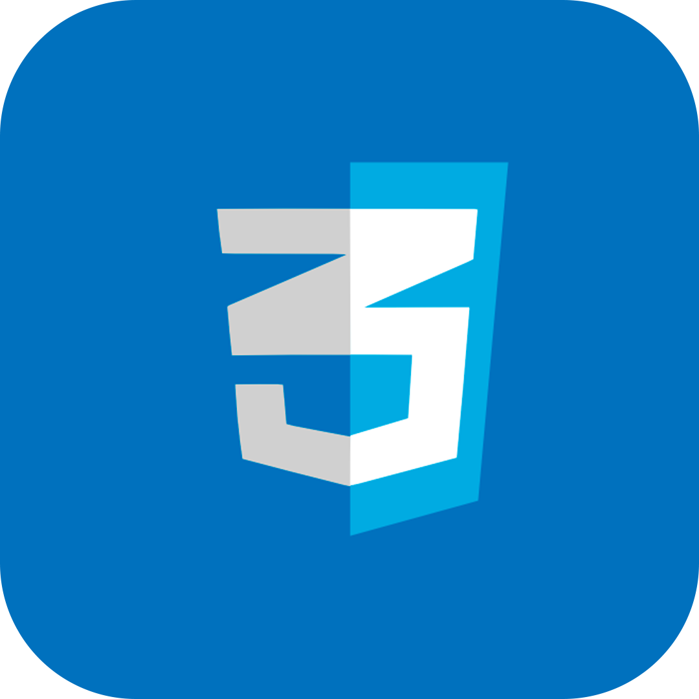
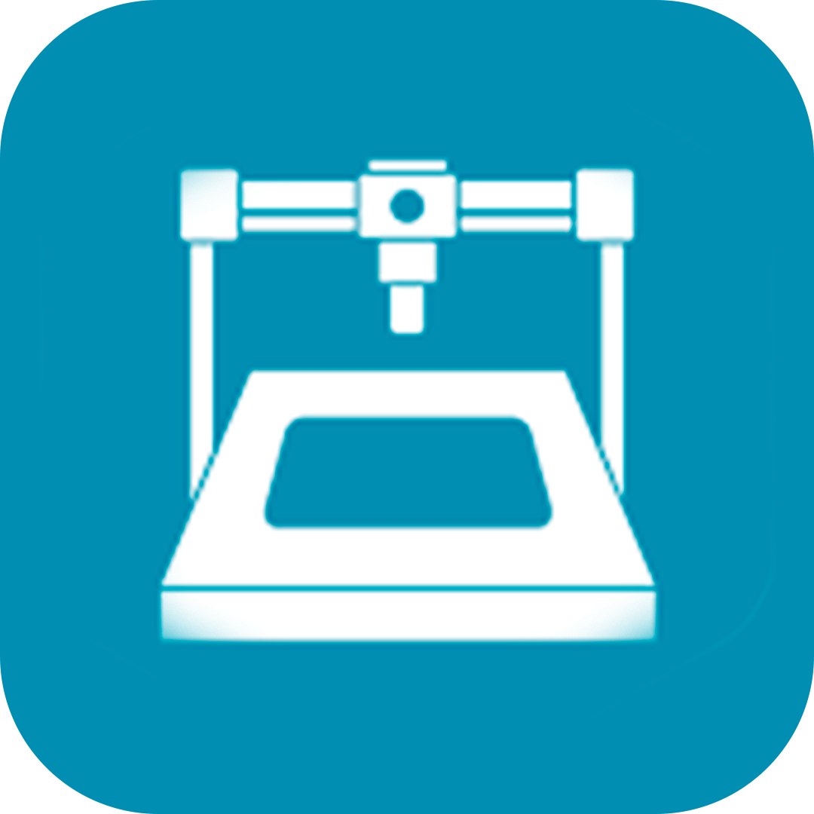
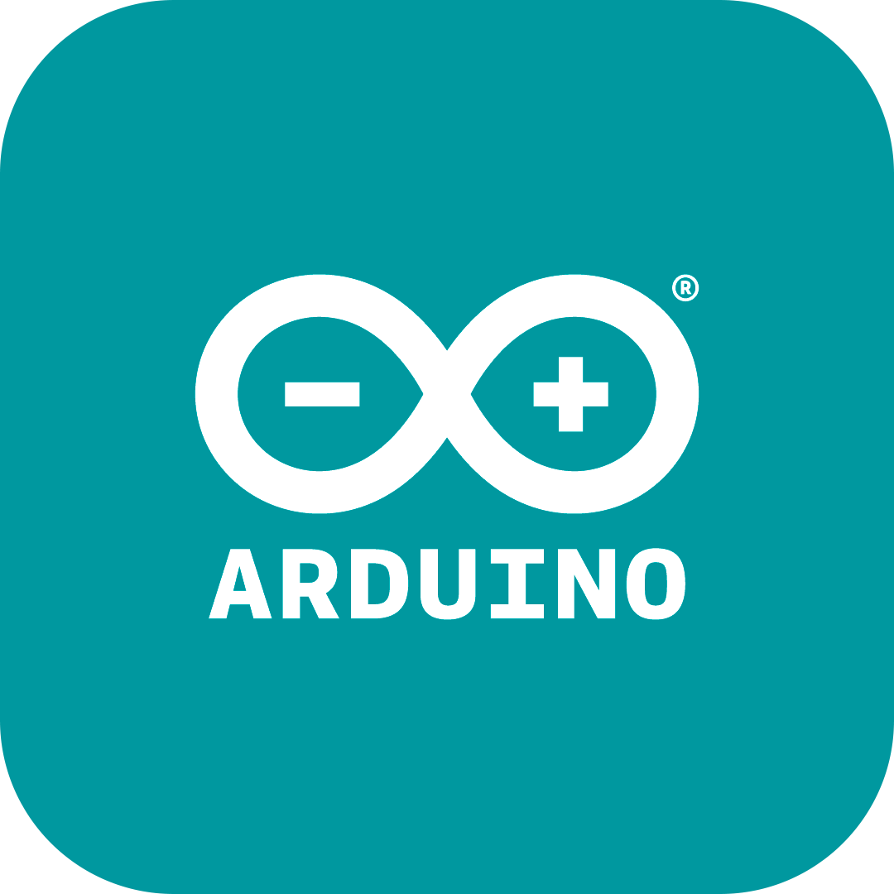
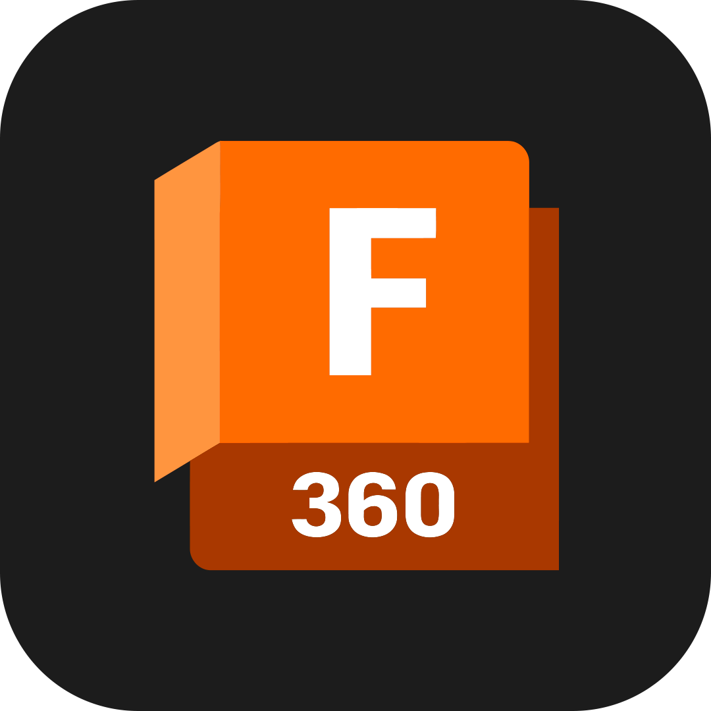
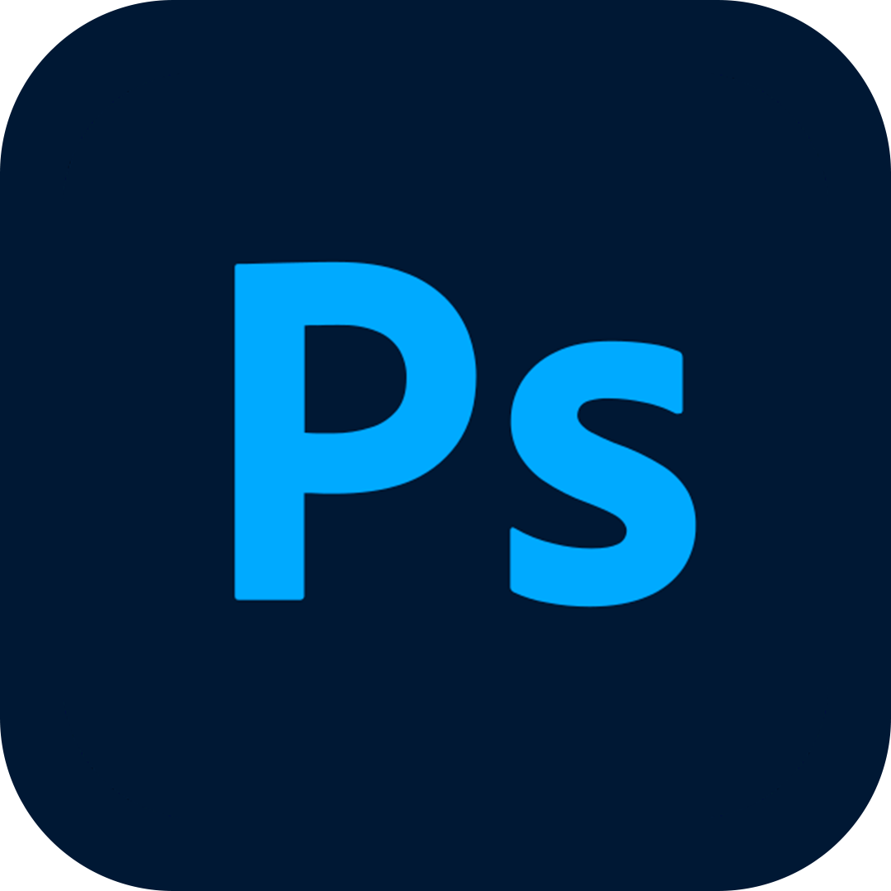
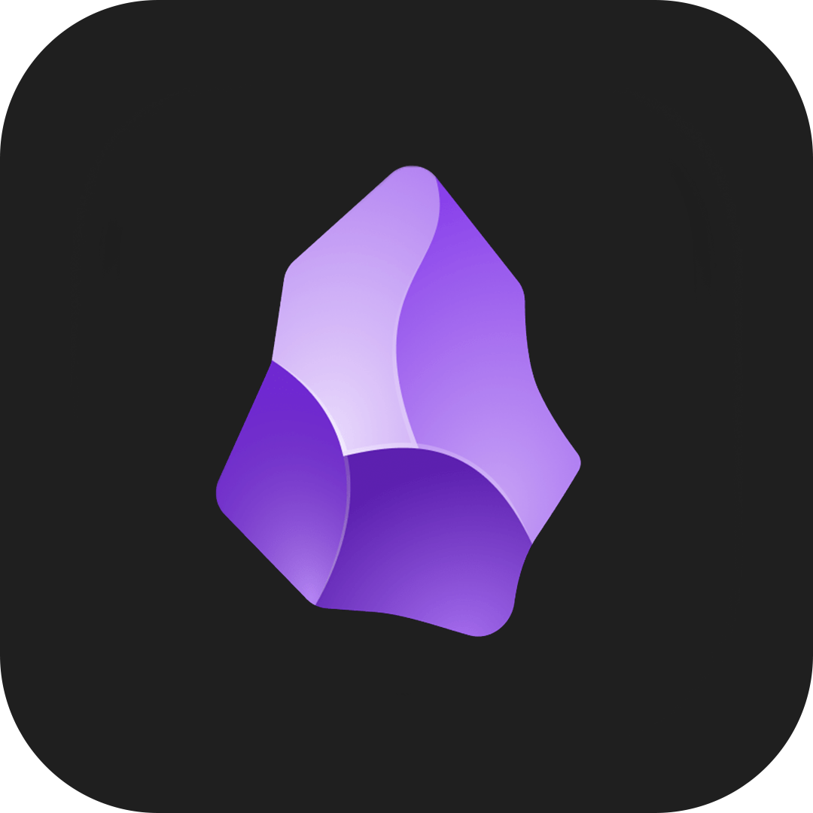
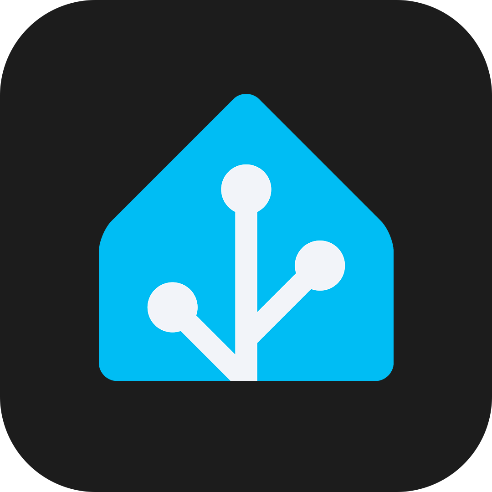
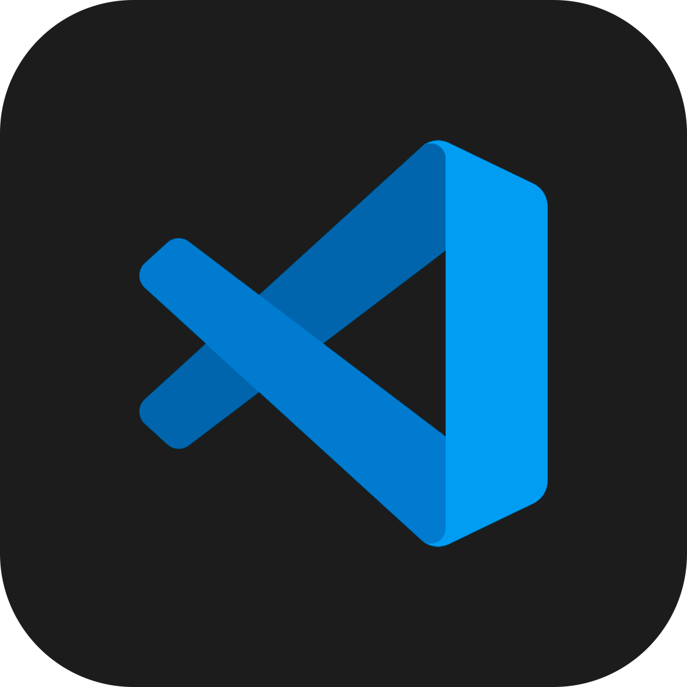

     

# Hello! I'm Thales Martins 👋

I'm passionate about technology, design, programming, and creativity. Here, you'll find the fusion of all these interests of mine (<i>It doesn't always turn out perfect, but I swear I try my best</i> 😆).

Feel free to explore my work and discover what I'm studying and developing.

<h2>🤔 Knowledge</h2>

  
  
  
  
  
  
  

<h2>🧰 Tools</h2>

  
  
  
  
  
  
  
</div
